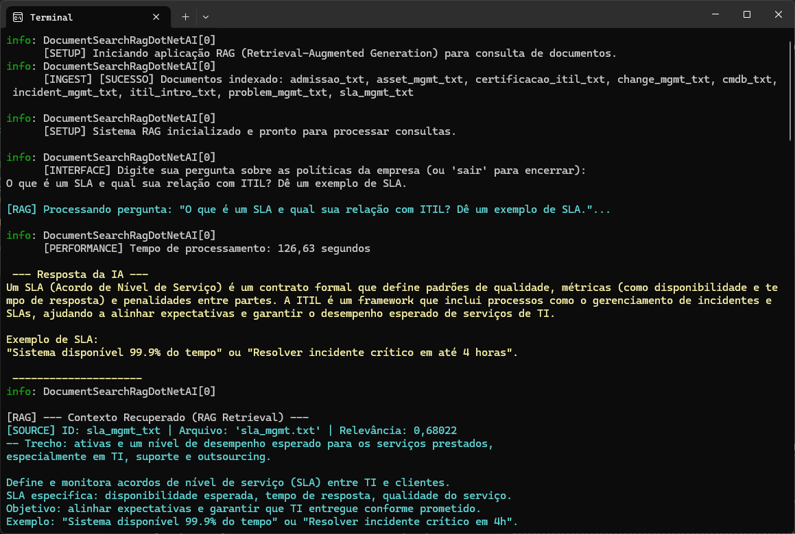
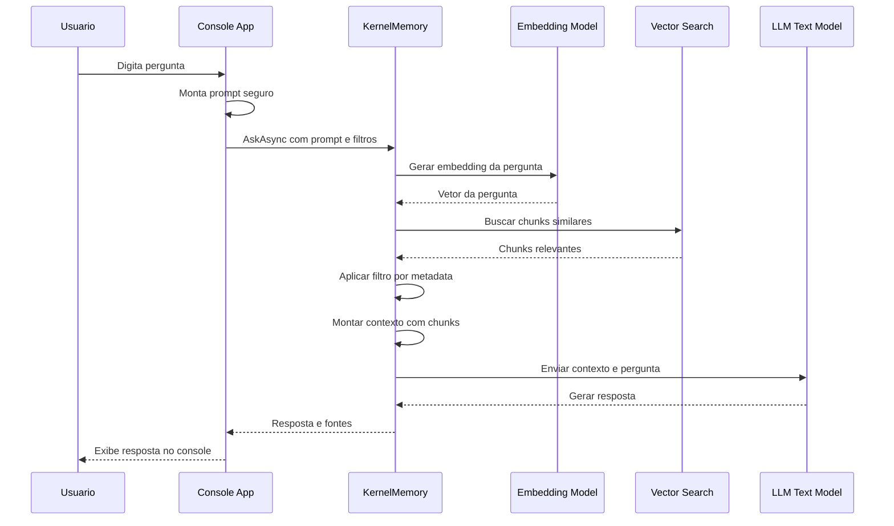

# DocumentSearchRagDotNetAI – RAG com .NET + Ollama para Busca de Documentos


## 📌 Descrição do Projeto

Este projeto é uma **aplicação de console em C#** criada para **testar e estudar a lógica de RAG (Retrieval-Augmented Generation)** utilizando:

* **KernelMemory**
* **Ollama**
* **Modelos LLM locais**
* **Busca semântica baseada em embeddings**

A aplicação **simula a consulta a uma base de conhecimento corporativa**, como uma `biblioteca de documentos` internos de uma empresa (políticas, normas, manuais, etc).



---

## 🧰 Tecnologias Utilizadas

### Backend / CLI

* **Linguagem:** [C#](https://learn.microsoft.com/dotnet/csharp/)  
* **Framework:** [.NET](https://dotnet.microsoft.com/)  
* **Lib / Tool (RAG):** [Microsoft Kernel Memory](https://github.com/microsoft/kernel-memory)  
* **LLM / Runtime:** [Ollama](https://ollama.ai/)  
  * **Modelo de Geração de Texto (LLM):**
    * `deepseek-r1:8b` - [Modelo de LLM](https://ollama.com/library/deepseek-r1:8b)
  * **Modelo de Embeddings:**
    * `bge-m3` (1024 dimensões) - [Modelo de Geração de Embeddings](https://ollama.com/library/bge-m3)

### Fluxo simples do código estruturado

```csharp
using Microsoft.KernelMemory;
using Microsoft.KernelMemory.AI.Ollama;
using Microsoft.KernelMemory.Configuration;

LogInfo("[SETUP] Iniciando aplicação RAG (Retrieval-Augmented Generation) para consulta de base de documentos corporativa.");

// Configuração do modelo de LLM (Large Language Model) para geração de texto e do modelo de Embeddings para vetorização.
var config = new OllamaConfig
{
    Endpoint = "http://localhost:11434", // Endpoint local do serviço Ollama
    TextModel = new OllamaModelConfig("deepseek-r1:8b", 131072), // Modelo LLM (DeepSeek). Contexto de 131k tokens permite processar prompts extensos.
    EmbeddingModel = new OllamaModelConfig("bge-m3", 1024) // Modelo de Embeddings atual (bge-m3). Gera vetores de 1024 dimensões para alta precisão semântica.
};

// Inicializa a construção do KernelMemory integrando com Ollama.
// O KernelMemory abstrai a complexidade de ingestão, armazenamento vetorial e recuperação de informações.
var memoryBuilder = new KernelMemoryBuilder()
    .WithOllamaTextGeneration(config)    // Configura o gerador de texto (LLM)
    .WithOllamaTextEmbeddingGeneration(config) // Configura o gerador de embeddings (Vetorização)
    .WithCustomTextPartitioningOptions(new TextPartitioningOptions
    {
        // Configuração de Chunking (Particionamento de texto) -> Divide os documentos em pedaços menores para indexação e busca vetorial.
        MaxTokensPerParagraph = 120, // Tamanho máximo do chunk em tokens. Chunks menores focam em conceitos específicos, melhorando a precisão da busca.
        OverlappingTokens = 30 // Sobreposição de tokens entre chunks adjacentes para preservar o contexto nas quebras de texto.
    });

var kernelMemory = memoryBuilder.Build();

LogInfo("Iniciando processo de ingestão e vetorização de documentos...");

var documentsFiles = DocumentService.GetAllTxtDocumentsFromDirectoryPath("Files");

foreach (var documentFilePath in documentsFiles)
{
    await kernelMemory.ImportDocumentAsync(
        filePath: documentFilePath,
        documentId: documentFilePath,
        tags: new TagCollection
        {
            { "tipo", "politica" },
            { "departamento", "rh" },
            { "fonte", "interna" }
        });

    LogSuccess($"[INGEST] [SUCESSO] Documento indexado: '{documentFilePath}'");
}

LogInfo("[SETUP] Sistema RAG inicializado e pronto para processar consultas.");

while (true)
{
    LogInfo("[INTERFACE] Digite sua pergunta sobre as políticas da empresa (ou 'sair' para encerrar):");

    var question = Console.ReadLine();

    // Prompt Engineering: Definição da "persona" e regras estritas para o modelo.
    // O objetivo é evitar alucinações (respostas fora do contexto) e manter o tom corporativo.
    var securePrompt = $"""
        Você é um assistente corporativo.

        INSTRUÇÕES OBRIGATÓRIAS:
        - Responda SOMENTE com base no CONTEXTO fornecido.
        - NÃO utilize conhecimento externo.
        - NÃO faça suposições.
        - Se não houver informação suficiente, responda EXATAMENTE:
          "Desculpe, não tenho essa informação no momento."

        FORMATO DA RESPOSTA:
        - Resposta curta e objetiva e no máximo 5 linhas

        PERGUNTA:
        {question}
    """;

    LogInfo($"[RAG] Processando pergunta: \"{question}\"...");

    var response = await kernelMemory.AskAsync(
        securePrompt,
        filter: new MemoryFilter().ByTag("tipo", "politica").ByTag("departamento", "rh")
    );

    // Resposta do Prompt gerado pela LLM exibido no console
    LogAIResponse(response.Result);

    if (response.RelevantSources.Count > 0)
    {
        LogInfo("\n[RAG] --- Contexto Recuperado (RAG Retrieval) ---");

        var relevantSourceOrderedByRelevant = response.RelevantSources
            .OrderByDescending(source => source.Partitions.FirstOrDefault()?.Relevance)
            .ToList(); // Ordena as fontes pela relevância do primeiro chunk encontrado

        foreach (var source in response.RelevantSources)
        {
            Log($"[SOURCE] ID: {source.DocumentId} | Arquivo: '{source.SourceName}' | Relevância: {source.Partitions.FirstOrDefault()?.Relevance:f5}");
            
            foreach(var partition in source.Partitions)
            {
                 Log($"-- Trecho: {partition.Text}");
            }
        }
    }
};
```

⚠️ **Escopo intencionalmente simples**
Este projeto **não é uma API**, **não é produção**, e **não possui interface gráfica**.
O foco é **entender o fluxo completo de RAG** de ponta a ponta.

### Conceitos de IA e RAG

* **LLM (Large Language Model):** Modelo de linguagem utilizado para gerar respostas em linguagem natural.
* **Embeddings:** Representações vetoriais dos textos, utilizadas para busca semântica.
* **RAG (Retrieval-Augmented Generation):** Arquitetura que combina recuperação de contexto dos documentos com geração de resposta pela LLM.
* **Chunking:** Particionamento dos documentos em trechos menores para melhorar a precisão da busca e do contexto.

> [!TIP]
> Não há configuração explícita de banco de dados relacional no código; o armazenamento vetorial e de documentos é gerenciado pela infraestrutura do Microsoft Kernel Memory.

---

## 🔄 Fluxo Básico do Projeto



**Resumo do fluxo:**

1. Usuário inicia a aplicação CLI e insere perguntas no console.  
2. A aplicação já realizou previamente a **ingestão de documentos** em `Files/` usando o Kernel Memory.  
3. Em cada pergunta:
   * A pergunta é enviada ao Kernel Memory, que executa o pipeline de **RAG**.
   * São recuperados os **chunks mais relevantes** dos documentos de políticas.
   * A LLM (via Ollama) gera uma resposta baseada nesse contexto.
4. A resposta e as principais fontes (documentId, relevância etc.) são exibidas no console.

---

## ▶️ Como Executar o Projeto

### Pré-requisitos

* [.NET SDK](https://dotnet.microsoft.com/en-us/download) instalado (versão compatível com o projeto).  
* [Ollama](https://ollama.ai/) instalado e em execução na máquina local.  
  * Endpoint padrão esperado pelo código: `http://localhost:11434`  
  * Modelos utilizados (ou equivalentes compatíveis configurados no Ollama):
    * Modelo de LLM: `deepseek-r1:8b` (ou outro ajustado no código).
    * Modelo de Embeddings: `bge-m3` (ou outro equivalente configurado no código).
* Acesso aos arquivos `.txt` que serão inseridos em `Files/` (por exemplo, políticas corporativas).

> A escolha dos modelos foi baseada nos resultados obtidos durante os testes de avaliação. O modelo de embeddings apresentou impacto significativo na acurácia da busca semântica, resultando em respostas mais consistentes e alinhadas às perguntas realizadas.

### Passo a Passo

```bash
# 1. Clone o repositório
git clone https://github.com/seu-usuario/DocumentSearchRagDotNetAI.git

cd DocumentSearchRagDotNetAI

# 2. (Opcional) Restaurar pacotes
dotnet restore

# 3. Execute o projeto
dotnet run

# 4. Garantir que o Ollama está rodando localmente em http://localhost:11434 com os models deepseek-r1:8b e bge-m3 baixados
# Exemplo (em outro terminal, se aplicável):
ollama serve

# 5. Garantir que o diretório Files contém os documentos .txt
# (por exemplo, políticas de RH da empresa)

# 6. Executar a aplicação
dotnet run
```

Após a execução:

* A aplicação realizará a **ingestão inicial** dos documentos em `Files/`.  
* Em seguida, o console exibirá um prompt para você digitar perguntas sobre as políticas da empresa.  
* Para sair, basta digitar `sair`.

---

## 🐳 (Opcional) Docker

Atualmente, o projeto **não possui** um `Dockerfile` ou `docker-compose.yml` totalmente definido no repositório.

Caso queira usar containers o projeto no futuro, um cenário típico seria:

* **Dockerfile**:  
  * Responsável por construir uma imagem contendo:
    * Runtime do .NET.
    * Artefatos da aplicação.
    * Dependências necessárias para se comunicar com o Ollama.
* **Docker Compose** (opcional):  
  * Orquestrar múltiplos serviços, por exemplo:
    * Um contêiner para a aplicação .NET.
    * Um contêiner para o Ollama (caso seja suportado no ambiente).

Exemplo (futuro) de comando para subir o projeto com Docker Compose:

```bash
docker compose up --build
```

> Como essa infraestrutura ainda não está definida no projeto, os passos acima servem apenas como referência para uma futura implementação de Docker.

---

## 📌 Observações Finais

* As respostas geradas pela LLM são **estritamente condicionadas** ao contexto retornado pelo RAG:
  * Se não houver informação suficiente, a aplicação orienta a LLM a responder com uma mensagem padronizada indicando a ausência de dados.
* A **qualidade das respostas** depende diretamente:
  * Da qualidade dos documentos em `Files/`.
  * Da cobertura das políticas e informações relevantes nesses arquivos.
* **Ambientes (dev/prod):**
  * Em desenvolvimento, é comum:
    * Ajustar o modelo de LLM e de embeddings no código.
    * Trabalhar com um conjunto menor de documentos para testes.
  * Em produção, recomenda-se:
    * Monitorar logs de relevância média, fontes de contexto e tempo de resposta.
  * Manter os arquivos de políticas atualizados no diretório de ingestão.
* Próximos passos possíveis:
  * Adicionar camadas de autenticação/autorização (se necessário, em um futuro front-end ou API).
  * Implementar persistência explícita dos vetores em um repositório próprio (caso o projeto cresça).
  * Criar endpoints HTTP ou UI web para substituir/complementar o uso via console.

### 🧠 Observação sobre uso de containers

Em um cenário de produção, o uso de Docker para a hospedagem de LLMs não é recomendado devido ao altíssimo consumo de recursos computacionais, especialmente CPU, GPU e memória. Para ambientes produtivos, é fortemente recomendado utilizar serviços de IA gerenciados, que oferecem melhor escalabilidade, alta disponibilidade, monitoramento, controle de custos e atualizações contínuas dos modelos.

Exemplos de serviços recomendados:

* Azure OpenAI Service, com integração nativa ao ecossistema .NET e recursos avançados de - segurança.
OpenAI API, amplamente utilizada, com modelos de alta performance para geração de texto e - embeddings.
AWS Bedrock, que disponibiliza diversos modelos fundacionais com escalabilidade gerenciada.
* Google Vertex AI, com suporte a modelos generativos e pipelines de ML.
* Cohere, especializada em modelos de linguagem e embeddings para busca semântica.
